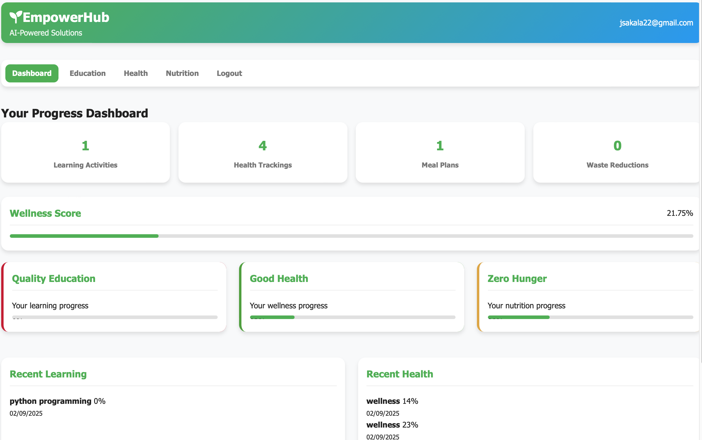

# 🌍 EmpowerHub – AI-Powered Solutions for SDGs 2, 3, 4  

> **Submission** – Addressing **Zero Hunger (SDG 2)**, **Good Health & Well-being (SDG 3)**, and **Quality Education (SDG 4)** with one integrated platform.  

---

## 🎯 Problem → 💡 Solution → 🌍 Impact  

- **Problem:** Communities struggle with access to **quality education, health tracking, and nutrition guidance**. Existing solutions are fragmented, expensive, or inaccessible.  
- **Solution:** **EmpowerHub**, an AI-powered web + mobile platform that brings **learning, health, and nutrition tools** together in one place.  
- **Impact:** Scales easily, empowers individuals, promotes healthier lives, and directly supports **SDGs 2, 3, and 4**.  

---

## 🚀 Overview  

**EmpowerHub** leverages **AI and open APIs** to empower communities with accessible solutions in **education, health, and nutrition**.  

The app allows users to:  
- 📘 **Learn smarter** with AI-powered personalized learning paths (SDG 4).  
- ❤️ **Stay healthy** through mental health check-ins, wellness tracking, and health Q&A (SDG 3).  
- 🥗 **Eat better** with meal planning, nutrition advice, and food waste reduction tips (SDG 2).  
- 💸 **Support sustainability** with **IntaSend-powered donations** to keep the project running.  

---

## ✨ Features  

### 🧑‍🏫 Education (SDG 4)  
- Generate **personalized learning paths** (Beginner → Advanced).  
- AI-powered **Q&A system** using Wikipedia API.  
- View **education history** and progress dashboards.  


### 🏥 Health (SDG 3)  
- **Mental health analysis** with simple AI sentiment scoring.  
- **Daily wellness tracking** (sleep, exercise, hydration).  
- AI-powered **health Q&A** with safety disclaimers.  
- Health history and wellness progress.  


### 🥦 Nutrition (SDG 2)  
- Generate **meal plans** based on ingredients + restrictions.  
- Get **nutrition advice** and educational tips.  
- Reduce **food waste** with creative ideas for expiring items.  
- Track nutrition history and environmental impact.  
  

### 📊 Unified Dashboard  
- Track progress across **all 3 SDGs** in one place.  
- See stats, history, and wellness scores.  


### 💳 Monetization  
- Integrated **IntaSend checkout** for donations and potential premium features.   

---

## 🛠️ Tech Stack  

- **Backend:** Flask (Python)  
- **Frontend:** HTML5, CSS3, JavaScript  
- **Database:** MySQL (structured storage for users, activities, health & nutrition data)  
- **Authentication:** JWT-based secure login  
- **APIs & AI:**  
  - Wikipedia API (Education Q&A)  
  - TheMealDB API (Meal suggestions)  
  - Advice Slip API (Mental health support)  
  - Custom sentiment analysis (free + lightweight)  
- **Payments:** IntaSend integration (donations)  

---

## ⚡ Installation & Setup  

### 1. Clone Repo  
```bash
git clone https://github.com/yourusername/empowerhub.git
cd empowerhub
```

### 2. Create Virtual Environment  
```bash
python -m venv venv
source venv/bin/activate   # Mac/Linux
venv\Scripts\activate      # Windows
```

### 3. Install Requirements  
```bash
pip install -r requirements.txt
```

### 4. Environment Variables  
Create a `.env` file:  
```bash
SECRET_KEY=your_secret_key
DATABASE_HOST=localhost
DATABASE_USER=root
DATABASE_PASSWORD=yourpassword
DATABASE_NAME=empowerhub_db
```

### 5. Run the Server  
```bash
python app.py
```
Server will run on: **http://127.0.0.1:5000**  

---

## 🎯 Usage  

1. **Register/Login** to get access.  
2. Explore the **Dashboard** for SDG progress.  
3. Use **Education, Health, and Nutrition tabs** to interact with AI-powered tools.  
4. Support the project via **IntaSend donations**.  

---

## 💡 Prompts Used  

As part of the hackathon rules, this app was **co-built with AI assistance** using carefully engineered prompts.  
Some of the **core prompts** we used:  

- *“You are a software engineer. I have a hackathon and the challenge is to identify real world problems targeting SDG 4, 3, 2 and provide a tech solution”*  
- *“Create a Flask backend with authentication, JWT, MySQL integration, and routes for education, health, and nutrition modules.”*  
- *“Design an index.html with sections for login, register, dashboard, education, health, and nutrition, styled with modern responsive CSS.”*    
- *“Write README with problem → solution → impact pitch.”*   

---

## 🌟 Future Enhancements  

- AI-powered **multilingual support**.  
- Gamification (badges, streaks).  
- Offline-first mobile app (PWA).  
- Expanded APIs for deeper personalization.  

---

## 👥 Team & Contributors  

Built with ❤️ by **EmpowerHub**.  
